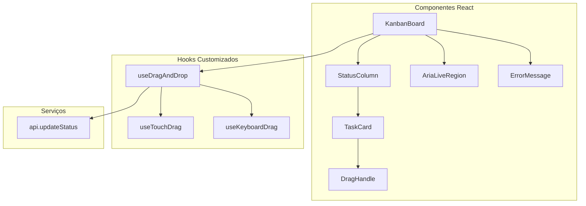
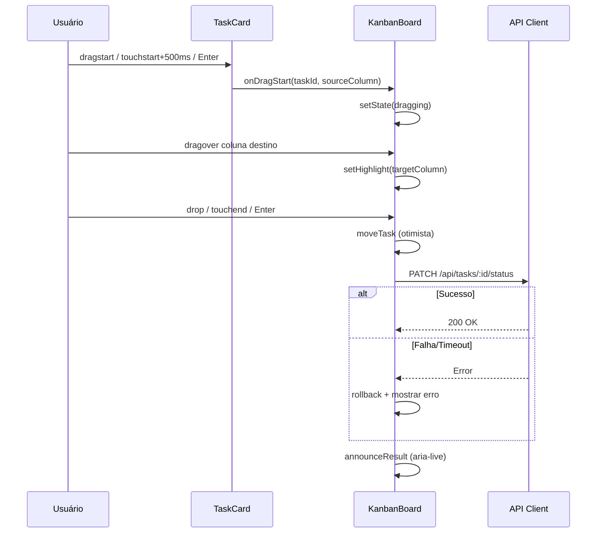

# Design Document: Kanban Drag and Drop

## Overview

Este documento descreve o design técnico para a funcionalidade de drag and drop no quadro Kanban. A implementação permite que administradores arrastem Task Cards entre colunas de status (A Fazer, Em Progresso, Concluída) para atualizar o status das tarefas de forma intuitiva, com suporte a acessibilidade via teclado e compatibilidade com dispositivos touch.

A abordagem utiliza a **HTML5 Drag and Drop API** nativa para desktop, complementada por **Touch Events** para dispositivos móveis, eliminando a necessidade de bibliotecas externas. O padrão de atualização otimista com rollback garante uma experiência responsiva mesmo em condições de rede adversas.

### Decisões de Design

| Decisão               | Escolha                                                            | Justificativa                                                                                |
| --------------------- | ------------------------------------------------------------------ | -------------------------------------------------------------------------------------------- |
| Biblioteca de DnD     | HTML5 nativa + Touch Events                                        | Sem dependência extra; o projeto já é leve e o caso de uso é simples (mover entre 3 colunas) |
| Padrão de atualização | Otimista com rollback                                              | UX responsiva; o card move imediatamente e reverte se a API falhar                           |
| Timeout da API        | 5 segundos (AbortController)                                       | Requisito 3.3; evita que o usuário fique esperando indefinidamente                           |
| Navegação por teclado | Enter/Espaço inicia, Setas navegam, Enter confirma, Escape cancela | Requisito 5.4; padrão ARIA para widgets arrastar/soltar                                      |
| Touch: long press     | 500ms com threshold de 10px vertical para distinguir scroll        | Requisitos 6.1 e 6.3; padrão mobile consolidado                                              |

## Architecture

### Diagrama de Componentes



### Fluxo de Dados



## Components and Interfaces

### Hook: `useDragAndDrop`

Hook principal que encapsula toda a lógica de drag and drop.

```typescript
interface DragState {
  isDragging: boolean;
  draggedTaskId: number | null;
  sourceColumn: TaskStatus | null;
  targetColumn: TaskStatus | null;
  dragCancelled: boolean;
}

interface UseDragAndDropOptions {
  tasks: Task[];
  isAdmin: boolean;
  onStatusChange: (taskId: number, status: string) => void;
}

interface UseDragAndDropReturn {
  dragState: DragState;
  // Handlers para HTML5 DnD API
  getTaskDragProps: (task: Task) => TaskDragProps;
  getColumnDropProps: (columnId: TaskStatus) => ColumnDropProps;
  // Anúncios de acessibilidade
  ariaAnnouncement: string;
  // Estado de erro
  error: string | null;
  dismissError: () => void;
}

interface TaskDragProps {
  draggable: boolean;
  onDragStart: (e: DragEvent) => void;
  onDragEnd: (e: DragEvent) => void;
  'aria-roledescription': string;
  'aria-label': string;
  tabIndex: number;
  onKeyDown: (e: KeyboardEvent) => void;
  style: { opacity: number; cursor: string };
}

interface ColumnDropProps {
  onDragOver: (e: DragEvent) => void;
  onDragEnter: (e: DragEvent) => void;
  onDragLeave: (e: DragEvent) => void;
  onDrop: (e: DragEvent) => void;
  className: string; // classes de highlight
}
```

### Hook: `useTouchDrag`

Hook para suporte a dispositivos touch com long press.

```typescript
interface UseTouchDragOptions {
  isAdmin: boolean;
  longPressDelay: number; // 500ms
  scrollThreshold: number; // 10px vertical
  onDragStart: (taskId: number, sourceColumn: TaskStatus) => void;
  onDragMove: (x: number, y: number) => void;
  onDragEnd: (targetColumn: TaskStatus | null) => void;
}

interface TouchDragProps {
  onTouchStart: (e: TouchEvent) => void;
  onTouchMove: (e: TouchEvent) => void;
  onTouchEnd: (e: TouchEvent) => void;
}
```

### Hook: `useKeyboardDrag`

Hook para navegação por teclado no drag and drop.

```typescript
interface UseKeyboardDragOptions {
  columns: TaskStatus[]; // ['todo', 'in_progress', 'done']
  currentColumn: TaskStatus;
  onMove: (targetColumn: TaskStatus) => void;
  onCancel: () => void;
  onAnnounce: (message: string) => void;
}
```

### Componente: `StatusColumn`

Wrapper da coluna que recebe os drop props e aplica estilos de highlight.

```typescript
interface StatusColumnProps {
  column: ColumnConfig;
  tasks: Task[];
  dropProps: ColumnDropProps;
  isHighlighted: boolean;
  children: React.ReactNode;
}
```

### Componente: `AriaLiveRegion`

Região invisível para anúncios de leitores de tela.

```typescript
interface AriaLiveRegionProps {
  message: string;
  politeness: 'assertive' | 'polite';
}
```

### Componente: `ErrorToast`

Mensagem de erro temporária com auto-dismiss.

```typescript
interface ErrorToastProps {
  message: string;
  duration: number; // 5000ms
  onDismiss: () => void;
}
```

## Data Models

### Estado do Drag

```typescript
type TaskStatus = 'todo' | 'in_progress' | 'done';

interface DragState {
  isDragging: boolean;
  draggedTaskId: number | null;
  sourceColumn: TaskStatus | null;
  targetColumn: TaskStatus | null;
  dragCancelled: boolean;
}

// Estado inicial
const initialDragState: DragState = {
  isDragging: false,
  draggedTaskId: null,
  sourceColumn: null,
  targetColumn: null,
  dragCancelled: false,
};
```

### Snapshot para Rollback

```typescript
interface TaskSnapshot {
  taskId: number;
  originalStatus: TaskStatus;
  originalIndex: number; // posição na lista da coluna
}
```

### Payload da API (existente)

```typescript
// PATCH /api/tasks/:id/status
interface StatusUpdatePayload {
  status: 'todo' | 'in_progress' | 'done';
}

// Resposta: Task completa atualizada
```

### Configuração Touch

```typescript
interface TouchConfig {
  longPressDelay: 500; // ms
  scrollThreshold: 10; // px vertical
  dragStartThreshold: 5; // px (desktop)
}
```

### Mapeamento de Colunas (existente, extraído)

```typescript
interface ColumnConfig {
  id: TaskStatus;
  title: string;
  icon: React.ComponentType;
  iconClass: string;
  headerClass: string;
}

// Reutilizado do array `columns` existente em KanbanBoard.tsx
```

## Correctness Properties

_Uma propriedade é uma característica ou comportamento que deve ser verdadeiro em todas as execuções válidas de um sistema — essencialmente, uma declaração formal sobre o que o sistema deve fazer. Propriedades servem como a ponte entre especificações legíveis por humanos e garantias de corretude verificáveis por máquina._

### Property 1: Controle de permissão para iniciar drag

_Para qualquer_ combinação de (role do usuário, distância de movimento em pixels), a operação de drag deve iniciar se e somente se a role for "admin" E a distância de movimento for >= 5 pixels. Caso contrário, o drag não deve iniciar.

**Validates: Requirements 1.1, 1.4**

### Property 2: Lógica de highlight de coluna

_Para qualquer_ combinação de (coluna de origem, coluna sob o cursor) durante uma operação de drag ativa, o destaque visual de drop deve ser exibido se e somente se a coluna sob o cursor for diferente da coluna de origem.

**Validates: Requirements 2.1, 2.2**

### Property 3: Cancelamento por Escape restaura estado

_Para qualquer_ estado de drag ativo (qualquer tarefa, qualquer coluna de origem, qualquer coluna alvo), pressionar Escape deve retornar o estado ao estado inicial (isDragging=false, draggedTaskId=null, dragCancelled=true) e o Task_Card deve permanecer na coluna e posição originais.

**Validates: Requirements 1.5, 4.1**

### Property 4: Drop em coluna diferente atualiza status

_Para qualquer_ tarefa em qualquer coluna de origem, se o drop ocorre sobre uma coluna de destino válida diferente da origem, então o status da tarefa deve ser atualizado para o status da coluna de destino e o card deve aparecer na nova coluna.

**Validates: Requirements 3.1, 3.5**

### Property 5: Payload da API contém status válido

_Para qualquer_ operação de drop bem-sucedida (coluna destino !== coluna origem), a requisição PATCH enviada ao servidor deve conter um campo `status` com valor pertencente ao conjunto {"todo", "in_progress", "done"}.

**Validates: Requirements 3.2**

### Property 6: Rollback restaura posição original em caso de falha

_Para qualquer_ tarefa que sofra drop e cuja requisição PATCH falhe ou exceda timeout, a tarefa deve retornar à coluna de origem e à mesma posição (índice) que ocupava antes do drop.

**Validates: Requirements 3.3**

### Property 7: Cancelamento nunca dispara chamada à API

_Para qualquer_ operação de drag que seja cancelada (por Escape ou drop fora de coluna válida), nenhuma requisição de rede deve ser enviada ao servidor, independentemente do estado de drag no momento do cancelamento.

**Validates: Requirements 4.3**

### Property 8: Anúncio ARIA durante drag contém nome da tarefa e coluna

_Para qualquer_ tarefa com título T sendo arrastada sobre uma coluna com nome C, o conteúdo da região aria-live deve conter tanto T quanto C, permitindo que leitores de tela informem a posição atual.

**Validates: Requirements 5.2**

### Property 9: Anúncio ARIA final corresponde ao resultado

_Para qualquer_ conclusão de operação de drag (movida para coluna X ou cancelada), o anúncio na região aria-live deve indicar corretamente se a tarefa foi movida (e para qual coluna) ou se a operação foi cancelada.

**Validates: Requirements 5.5**

### Property 10: Transições de estado de teclado

_Para qualquer_ sequência válida de teclas (Enter/Espaço para iniciar, ArrowLeft/ArrowRight para navegar, Enter para confirmar, Escape para cancelar), o estado do drag deve transicionar de acordo com a máquina de estados: idle → dragging → navegando entre colunas → confirmado/cancelado, sem transições inválidas.

**Validates: Requirements 5.4**

### Property 11: Threshold de toque para iniciar drag

_Para qualquer_ interação touch com duração D milissegundos e deslocamento vertical V pixels, o drag touch deve iniciar se e somente se D >= 500ms E V <= 10px. Se V > 10px antes de 500ms, deve ser interpretado como scroll. Se o toque é liberado antes de 500ms, deve ser interpretado como tap.

**Validates: Requirements 6.1, 6.3, 6.4**

### Property 12: Atributos ARIA no drag handle

_Para qualquer_ Task_Card com título T, o elemento drag handle deve possuir `aria-roledescription` igual a "arrastar tarefa" e `aria-label` contendo T.

**Validates: Requirements 5.1**

## Error Handling

### Cenários de Erro

| Cenário                | Causa                   | Tratamento                           | UX                                                 |
| ---------------------- | ----------------------- | ------------------------------------ | -------------------------------------------------- |
| PATCH falha (4xx/5xx)  | Erro no servidor        | Rollback otimista + toast de erro    | Card volta à posição original, mensagem visível 5s |
| Timeout (>5s)          | Rede lenta/indisponível | AbortController cancela, rollback    | Mesmo comportamento de falha                       |
| Drop fora de coluna    | Soltar em área inválida | Cancelar sem requisição              | Card volta suavemente à posição original           |
| Permissão insuficiente | Usuário não-admin       | Drag impedido no início              | Cursor padrão, cards não arrastáveis               |
| Token expirado         | Sessão encerrada        | Interceptado pelo `api.ts` existente | Redireciona para login                             |

### Implementação do Rollback

```typescript
// Snapshot antes do drop otimista
const snapshot: TaskSnapshot = {
  taskId: task.id,
  originalStatus: task.status,
  originalIndex: columnTasks.indexOf(task),
};

// Após falha
function rollback(snapshot: TaskSnapshot) {
  // Restaura task para coluna e posição original
  setTasks((prev) => {
    const updated = prev.map((t) =>
      t.id === snapshot.taskId ? { ...t, status: snapshot.originalStatus } : t,
    );
    return updated;
  });
}
```

### Mensagem de Erro (Toast)

- Texto: "Falha ao atualizar status da tarefa. Tente novamente."
- Duração: 5 segundos com auto-dismiss
- Dismiss manual: botão X ou clique
- Posição: canto inferior direito
- Estilo: fundo vermelho/alarme consistente com Tailwind existente

## Testing Strategy

### Abordagem Dual

A estratégia combina testes unitários para cenários específicos e testes baseados em propriedade para garantias universais.

### Testes Unitários (Exemplos e Edge Cases)

| Teste                                    | Tipo      | Valida       |
| ---------------------------------------- | --------- | ------------ |
| Drag preview exibe conteúdo correto      | EXAMPLE   | Req 1.2      |
| Opacidade 0.5 durante drag               | EXAMPLE   | Req 1.3      |
| Highlight removido em dragLeave          | EXAMPLE   | Req 2.3      |
| Highlight removido ao finalizar drag     | EXAMPLE   | Req 2.4      |
| Toast de erro aparece em falha da API    | EXAMPLE   | Req 3.4      |
| Botões de status têm aria-label corretos | EXAMPLE   | Req 5.3      |
| Preview touch segue posição do toque     | EXAMPLE   | Req 6.2      |
| Escape sem drag ativo não altera estado  | EDGE_CASE | Req 4.5      |
| Drop fora de colunas cancela operação    | EDGE_CASE | Req 3.6, 4.2 |

### Testes Baseados em Propriedade (Property-Based Tests)

**Biblioteca**: `fast-check` (compatível com Bun e TypeScript)

**Configuração**: Mínimo 100 iterações por propriedade

Cada propriedade de corretude (1-12) será implementada como um teste PBT com tag no formato:

```
Feature: kanban-drag-and-drop, Property {N}: {título da propriedade}
```

**Geradores necessários**:

| Gerador                 | Produz                               | Usado em                    |
| ----------------------- | ------------------------------------ | --------------------------- |
| `arbTaskStatus()`       | "todo" \| "in_progress" \| "done"    | P2, P3, P4, P5, P6          |
| `arbUserRole()`         | "admin" \| "editor" \| "viewer"      | P1                          |
| `arbPixelDistance()`    | número 0-100                         | P1                          |
| `arbTask()`             | Task com campos válidos aleatórios   | P4, P5, P6, P7, P8, P9, P12 |
| `arbTouchInteraction()` | {duration: ms, verticalDelta: px}    | P11                         |
| `arbKeySequence()`      | sequência de teclas válidas          | P10                         |
| `arbColumnPair()`       | (source, target) distintos ou iguais | P2, P4                      |

### Cobertura

- **Propriedades 1-12**: Testam lógica pura dos hooks/funções
- **Testes unitários**: Testam integração com DOM/React
- **Testes manuais**: Responsividade touch em dispositivos reais, timing visual (100ms transitions)

### Framework de Testes

- Runtime: Bun test runner (`bun test`)
- PBT: `fast-check`
- DOM testing: `@testing-library/react` + `jsdom`
